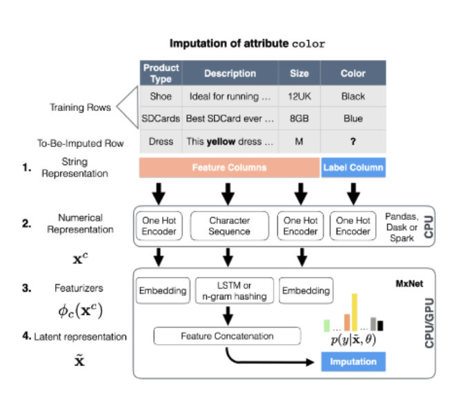

- [Why is Data Quality Important](#why-is-data-quality-important)
- [Real World Data](#real-world-data)
- [Changes in Data Collection Strategies](#changes-in-data-collection-strategies)
  - [Pre-Internet Era](#pre-internet-era)
  - [Internet Era](#internet-era)
- [Sources of Errors](#sources-of-errors)
- [Dimensions of Quality](#dimensions-of-quality)
- [How to improve Data Quality](#how-to-improve-data-quality)
  - [Data entry interface design](#data-entry-interface-design)
  - [Organizational management](#organizational-management)
  - [Automated data auditing and data cleaning](#automated-data-auditing-and-data-cleaning)
  - [Exploratory data analysis and dat cleaning](#exploratory-data-analysis-and-dat-cleaning)
- [Data Cleaning - Types and Techniques](#data-cleaning---types-and-techniques)
  - [Quantitative](#quantitative)
  - [Categorical](#categorical)
  - [Postal Addesses](#postal-addesses)
  - [keys / Identifiers](#keys--identifiers)
- [The need for a "Human-in-the-loop"](#the-need-for-a-human-in-the-loop)
  - [Unrealistic assumption](#unrealistic-assumption)
  - [In practice](#in-practice)
- [Cleaning Techniques](#cleaning-techniques)
  - [Quantitative Data](#quantitative-data)
  - [Categorical Data](#categorical-data)
    - [Normalization of String data](#normalization-of-string-data)
      - [Keying function](#keying-function)
    - [Candidate Key Detection](#candidate-key-detection)
      - [unique row ratio](#unique-row-ratio)
      - [unique value ratio](#unique-value-ratio)
    - [Missing value (Imputation with ML)](#missing-value-imputation-with-ml)
      - [Missing data](#missing-data)
      - [Handling missing values](#handling-missing-values)
      - [Imputation problem as multi-class](#imputation-problem-as-multi-class)

# Why is Data Quality Important
- Impact on organisational decisions
(missing or incorrect data can result in wrong decision making)

- Legal obligations in certain business scenarios
(e.g., plug type information required for selling electric devices in EU)

- Impact on machine learning models
(cleaner data can greatly improve model performance)

- Potential for causing biased decisions in ML-based applications
(not well understood, area of active research)

- Operational stability: missing and inconsistent data can cause havoc in production systems
  - Crashes (e.g., due to “NullPointerExceptions” for missing attributes)
  - Wrong predictions (e.g., change of scale in attributes)

# Real World Data

- Constantly changing
- Often hundreds of attributes
- Data originates from multiple sources /
people / teams / systems
- Several potentially inconsistent copies
- Often too large to conveniently handle on a
desktop machine
- Often difficult to access (e.g., data
compressed and partitioned in a distributed
filesystem)

# Changes in Data Collection Strategies

## Pre-Internet Era
  - Data initially collected in transactional, relational databases
  - Data Modelled before collection
  - Backward-looking analysis of well understood business data
  
## Internet Era
  - Collect first, analyze later
  - Vast amount of semi-structured data (images, text, audio)
  - New data stores (k-v, document, file system: data lakes)
    - relaxed consistency (as no distributed transactions)
    - enforce few modelling decisions at collection time
    - schema-on-road: application must interpret the data
  - Storage costs decreased
  - Data becomes valuable as input to ML-based applications

# Sources of Errors

- Data Entry errors
  - Typos in Forms
  - Different spellings for the same real-world entity
- Measurement errors
  - outside interference in measurement process
  - configuration/placement of sensors changed
    - e-commerce -> mobile network instability
- Distillation errors
  - errors in data summaries (logarithm)
  - editorial bias in data summaries 
- Data integration errors
  - Resolution of inconsistencies w.r.t duplicate entries
  - unification of units, measurement periods

# Dimensions of Quality

- Completeness 
  - Degree to which data required to describe a real-world object is available 
- Consistency: Intra-Relation constraints
  - Specific data type, interval for a numerical column, set of values for a categorical column
- Consistency: Inter-Relation constraints
  - Validity of references to other data entries (foreign keys)
- Syntactic Accuracy
  - red, blue ... (syntactically correct but not match real value)
- Semantic Accuracy
  - XL, red ... (match real-world representation)

# How to improve Data Quality

## Data entry interface design
- Enforce Integrity constraints (e.g. constraints on numeric values, referential integrity)
- Caveat: can force users to "invent" dirty data (still need to care about it)

## Organizational management 
- Streamlining of processes for data collection and analysis (capture error earlier)
- Capturing of provenance and metadata

## Automated data auditing and data cleaning 
- Application of automated techniques to identify and rectify data errors 

## Exploratory data analysis and dat cleaning
- human in the loop approach necessary most of the time
- interaction between data viz and data cleaning iterative process

# Data Cleaning - Types and Techniques
## Quantitative
- integers or floating numbers in different shapes (sets, tensors, time series)
- challenges: unit conversion (especially for volatile units like currency)
- foundation of cleaning techniques: outlier detection
## Categorical 
- names or codes to assign data into groups, no ordering or distance defined 
- common problem: misspelling upon data entry 
- foundation of cleaning techniques: normalization/deduplcation

## Postal Addesses
- special case of categorical data, typically entered as free text
- deduplication 

## keys / Identifiers 
- ensure referential integrity

# The need for a "Human-in-the-loop"
## Unrealistic assumption
- existence of error detecting rules assumed: integrity constraints, functional dependencies
- focus on most efficient and accurate way to apply cleaning steps according to rules

## In practice 
- EDA + Viz + cleaning 
- Iterative approach 
- Open Refine, Trifacta (Alteryx)

# Cleaning Techniques
## Quantitative Data 
- Robust Univariate Outlier Detection
  - Robust Centers (robust statistics are closer then median)
    - Median
    - K-trimmed mean
  - Robust Dispersion
    - MAD (median absolute deviation)
      - measures median distance of all values from the sample median

## Categorical Data
### Normalization of String data
- Different spellings (Jerome vs Jerome)
- Different punctuation (ACME Inc. vs ACME, Inc)
- Typos (Alice->Ailce)
- Misunderstandings (Rupert -> Robert)

#### Keying function
- Use keying function to form cluster with the computed key
- Automatic repair
  - replace all strings in a cluster with the string with the highest cardinality S(s) in S
- Manual repair (OpenRefine implementation)
  - show clusters and stats to user
  - have user decide about replacement

### Candidate Key Detection
#### unique row ratio
- number of distinct value / total number of rows
- problem: frequency outliers (lots of frequent -999)
  - often caused by UIs forcing users to invent common dummy values like 0000 or -999
#### unique value ratio
- number of unique value (only occur once) / number of distinct value

### Missing value (Imputation with ML)
#### Missing data
- Missing Completely at Random (MCAR)
  - as if we lost some entries by chance
- Missing at Random (MAR)
  - missingness depends on observed job type
  - engineers more likely to not share income than managers
- Not Missing at Random (NMAR)
  - missingness data depends on missing data itself
  - people with low income do not want to share this information

#### Handling missing values
- remove examples with missing attributes
- placeholder symbol for categorical missing values
- impute missing values - with mode or mean of the observed values in the column

#### Imputation problem as multi-class
Idea: Treat imputation problem as multi-class classification problem
- Tool: [Datawig](https://github.com/awslabs/datawig)
  - use rows with non-missing data in target columns as training data
  - encode table data from feature columns to a numerical representation
    - one-hot encoding of categorical 
    - standardisation of numerical columns
    - character sequences for textual columns
      - LSTM (word embedding)/ n-gram hashing (frequency based - tfidf)

