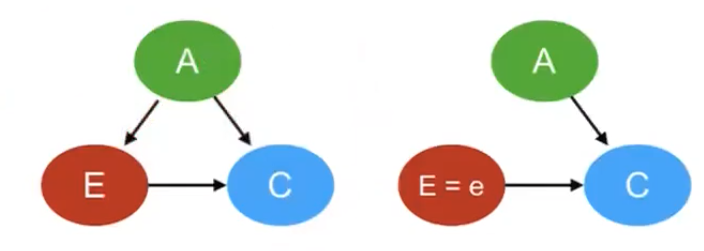

- [Table of Content](#table-of-content)
  - [Do(X = x) operator](#dox--x-operator)
  - [(Post-) interventional distribution for V](#post--interventional-distribution-for-v)
  - [Formal definition of causality (causal effect)](#formal-definition-of-causality-causal-effect)
  - [Average causal effect](#average-causal-effect)
  - [Observational vs post-interventional distributions exercise](#observational-vs-post-interventional-distributions-exercise)
    - [Proof $P(A|do(S=1)) \\equiv P(A|S=1)$](#proof-pados1-equiv-pas1)
    - [Simpson paradox (with confounder)](#simpson-paradox-with-confounder)
      - [Proof $P(C|E=e) \\neq P(C|do(E=e))$](#proof-pcee-neq-pcdoee)

# Table of Content

## Do(X = x) operator
- represent a hypothetical intervention on the whole population

## (Post-) interventional distribution for V
- $P(X_{v}|do(X=x)) \neq P(X_{v})$
- Example: $P(F=1|do(A=1)) \neq P(F=1) ?\neq?  P(F=1|A=1)$
  - the probablity of Fire if we set alarm = 1 not equal to fire = 1, may not be equal to fire = 1 given alarm =1

## Formal definition of causality (causal effect)
- X has a causal effect on Y if
  - $\exist{x,x\prime}: P(Y|do(X=x)) \neq P(Y|do(X=x\prime))$
- Example
  - $P(F=1|do(A=0)) = P(F=1|do(A=1)) = P(F=1)$
  - $P(F=0|do(A=)) = P(F=0|do(A=1)) = P(F=0)$
  - => Alarm does not cause Fire

## Average causal effect
Next Week

## Observational vs post-interventional distributions exercise

### Proof $P(A|do(S=1)) \equiv P(A|S=1)$ (no confounding effect)
- F-> S -> A (causal graph)
- when we do interventions on S: do(S=1), then we have
- F x S -> A (causal graph)

1. Starting from bayesian network factorization
$$
P(F,S,A) = P(F)P(S|F)P(A|S)
$$

2. Then bayesian network truncated factorization (joint distribution)
$$
P(F,S,A|do(S=s)) = P(F)P(A|S)I(S=s)
$$

3. Then we calculate marginal distribution over F (as we don't need F)
$$
P(S,A|do(S=s)) = marginal(P(F)P(A|S)I(S=s))\\
= \sum_{F=f}P(F=f)P(A|S)I(S=s) \\
= P(A|S)I(S=s)\sum_{F=f}P(F=f) \\
= P(A|S)I(S=s) \\
$$

4. Then we calculate marginal of S (as we don't need S)
$$
P(A|do(S=s)) = marginal(P(A|S)I(S=s)) \\
= \sum_{S=s\prime}P(A|S=s\prime)I(S=s) \\
= P(A|S=1)I(S=1) + P(A|S=0)I(S=0)
$$

5. When we set S=1 then it means I(S=1) = 1,  I(S=0) = 0, then our proof finished
$$
P(A|do(S=1)) = P(A|S=1)
$$

### Simpson paradox (with confounder)

#### Proof $P(C|E=e) \neq P(C|do(E=e))$
- when we do interventions on S: do(E=e), then we have
- A -> C <- E (A x E)

1. Starting from bayesian network factorization
$$
P(A,C,E) = P(A)P(E|A)P(C|A,E)
$$

2. Then bayesian network truncated factorization (joint distribution)
$$
P(A,C,E|do(E=e)) = P(A)P(C|A,E)I(E=e)
$$

3. Then we calculate marginal distribution over A (as we don't need F)
$$
P(C,E|do(E=e)) = \sum_{A=a}P(A=a)P(C|A=a,E)I(E=e) \\
= I(E=e)\sum_{A=a}P(A=a)P(C|A=a,E)
$$

4. Then we calculate marginal distribution over E (as we don't need E)

$$
P(C|do(E=e)) = \sum_{E=e\prime}(I(E=e)\sum_{A=a}P(A=a)P(C|A=a,E=e\prime))\\
= \sum_{A=a}P(A=a)P(C|A=a,E=e)
$$

5. if we look at $P(C,A|E)$
$$
P(C,A|E)= \frac{P(C,A,E)}{P(E)} \\
P(C,A,E) = P(E)P(A|E)P(C|A,E) \\
P(C,A|E) \frac{P(E)P(A|E)P(C|A,E)}{P(E)} \\
= P(A|E)P(C|A,E)
$$

6. Then we calculate marginal distribution over A (as we don't need A)
$$
P(C|E=e)=\sum_{A=a}P(A=a|E=e)P(C|A=a,E=e)
$$

7. Proof finished
$$
P(C|E=e)=\sum_{A=a}P(A=a|E=e)P(C|A=a,E=e) \\
\neq \sum_{A=a}P(A=a)P(C|A=a,E=e)
$$