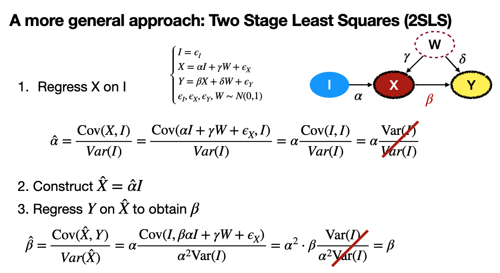

# Table of Contents
## Motivations
- we want to estimate the effect of X on Y
- we cannot use the backdoor/adjustment criteria, because W is unobserved
- we cannot use frontdoor because there is no mediator
- we can exploit the instrumental variable (IV) **I** iff all these hold (I -> X -> Y)
  - I $\to$ X (Substantial first stage) -> I must really change X
  - I $\perp \!\!\! \perp$ W (Independence Assumption) -> I must be randomized
  - I $\to$ Y not direct connected (Exclusion Restriction) -> must be the only directed path

> There exists also conditional instrumental variables

## Two Stage Least Squares (2SLS)

- Weak instrument: small cov(I,V) leads to big errors in $\beta^{IV}$
- strong requirements (those assumptions)
- Conditional IV (????)