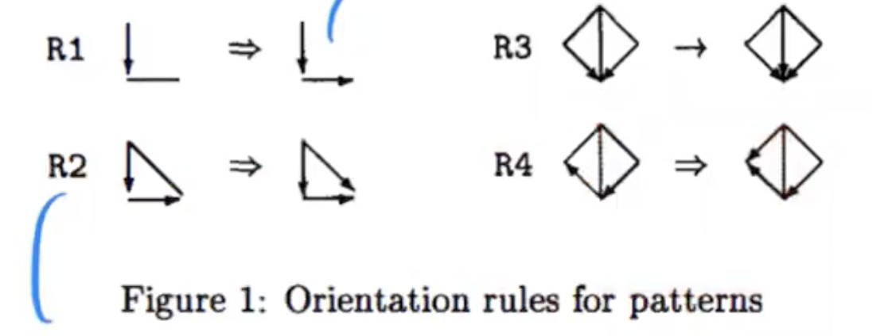

- [Complete Partially Directed Acyclic Graph (CPDAG)](#complete-partially-directed-acyclic-graph-cpdag)
- [How to create CPDAG](#how-to-create-cpdag)
  - [we know the true graph](#we-know-the-true-graph)
  - [we don't know the true graph](#we-dont-know-the-true-graph)
    - [SGS](#sgs)
      - [Problems](#problems)
    - [PC](#pc)
      - [Problems](#problems-1)
    - [Main Advantage of constraint-based methods (FCI)](#main-advantage-of-constraint-based-methods-fci)

## Complete Partially Directed Acyclic Graph (CPDAG)
- We have a directed edge  if all DAGs in the MEC have  i -> j 
- We have an undirected edge i - j if some DAGs in the MEC have i->j and others have j->i

## How to create CPDAG
### we know the true graph
1. if the true graph is known we can compute the CPDAG representing the MEC

### we don't know the true graph
we perform conditional independence tests on observational data 
and use them to constrain the possible graphs using d-separation

#### SGS
We can estimate a CPDAG from samples of P in three steps: 
1. Determine the skeleton 
   1. using independency tests/conditional independency tests
   2. remove all edges that are independent / conditionally independent
2. Determine the v-structures (A -> B <- C)
   1. find unshielded triplets candidates
   2. A,C|B, X1, X2 ... all combo should be dependent
3. Direct as many remaining edges as possible 
   1. make sure new direct cannot create cycles or new v-structures
   2. meek's rule 
> the directed parts of the CPDAG will agree with , but some parts might stay undirected

##### Problems 
Computationally inefficient

#### PC
Determine the skeleton in optimized way
- if i is not adjacent to j, then they can be d-separated by Pa(i) and Pa(j)
- if there exists a set S $\subset$ (Adj(i) $\cup$ Adj(j)) so that i indep j | S, then remove i-j

##### Problems
1. Too few samples
2. very weak dependence
3. wrong parametric assumption
4. when there are unmeasured confounders or selection bias, PC cannot do it
#### Main Advantage of constraint-based methods (FCI)
- causal sufficiency (latent confounder)

