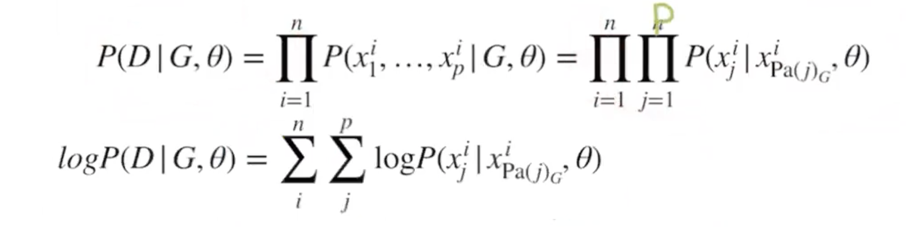
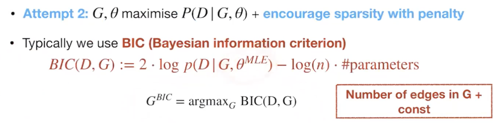

- [Score-based causal discovery](#score-based-causal-discovery)
  - [Definition](#definition)
  - [Score based](#score-based)
  - [BIC (Bayesian Information Criterion)](#bic-bayesian-information-criterion)
    - [BIC Properties](#bic-properties)
  - [How to search for DAG with highest score](#how-to-search-for-dag-with-highest-score)
  - [Greedy Equivalence Search (GES)](#greedy-equivalence-search-ges)

## Score-based causal discovery
### Definition
find the graph that maximizes a score S(G,D) (fit of a Graph G on data D) 

$\hat{G} = argmax_{G\in{g}}S(G,D)$

- Also called bayesian network structure learning
- All DAGs in MEC have the same score

### Score based 
1. we assume that we know the parametric form of SCM
   - Linear functions with parameters B - Gaussian noises with variance $\Sigma$
   - $X = BX + \epsilon$
2. Frobenius norm (number of non-zero elements in B)

### BIC (Bayesian Information Criterion)
1. We have a dataset D={X1, X2, ... Xn} of N, i.i.d samples, where each Xv = {X_1, X_2, ... X_p} is a realization for a unit i for all random variables X_v

2. Attempt Bayesian Theorem
$P(G,\Theta|D)= \frac{P(D)P(G,\Theta)}{P(D)}$

3. Finds G,$\Theta$ that maximize $P(D)P(G,\Theta)$

4. Log Likelihood

5. Maximum Likelihood

6. Use BIC to prevent from overfitting
since the more edges we have, the higher the MLE we get, hence we need to penalize the fact that we increase edges

#### BIC Properties

- Score equivalence 
   - All DAGs in a MEC get the same score
- Decomposable
   - if we want to compare two similar DAGs, we just need to check the variables with different edges, the rest stays the same
 - Local consistency 
   - adding edges that create superfluous d-connections (that are independencies in data) decreases score, instead adding an edge 

### How to search for DAG with highest score
- Number of DAGs grows super-exponentially
  - we cannot do exhaustive search for BIC
- Greedy search for graphs
  - Candidate G with score S
  - Determine neighbouring graphs G*
  - Find best scoring neighbour $G^* = argmax_{G\in{g}}S(G,D)$
  - Take $G^*$ as new candidate graph G and iterate
  - Otherwise return G
- Greedy Equivalence search (GES)
  - reduce the search space by searching over CPDAGs instead of DAGs 
  - all DAGs in the same Markov equivalence class (MEC) (represented by same CPDAG) have the same score (so you can pick any)
  - searching over CPDAGs with local consistency allows us to find the global optimum (in large sample limit)

### Greedy Equivalence Search (GES)
Decomposability makes that add/remove edges are computationally efficient

- start with empty CPDAG
- Forward (phase1): add edge until local maxima in BIC
- Backward (phase2): remove edge until local maxima in BIC

Tips: 
1. Given a DAG, produce the skeletons
2. Try different directions and find different CPDAG (MEC)
3. Add edge cannot create cycles
4. Try different directions and find different CPDAG (MEC)
5. Remove edge cannot create cycles

- GES returns a CPDAG
- Identification strategies are based on known DAG
  - add background knowledge
  - add experimental/interventional data 
- under some assumptions we can recover the true causal graph
  - nonlinear models with additive noise: additive noise model (ANM)
  - linear non-gaussian acyclic models (LINGAM)

