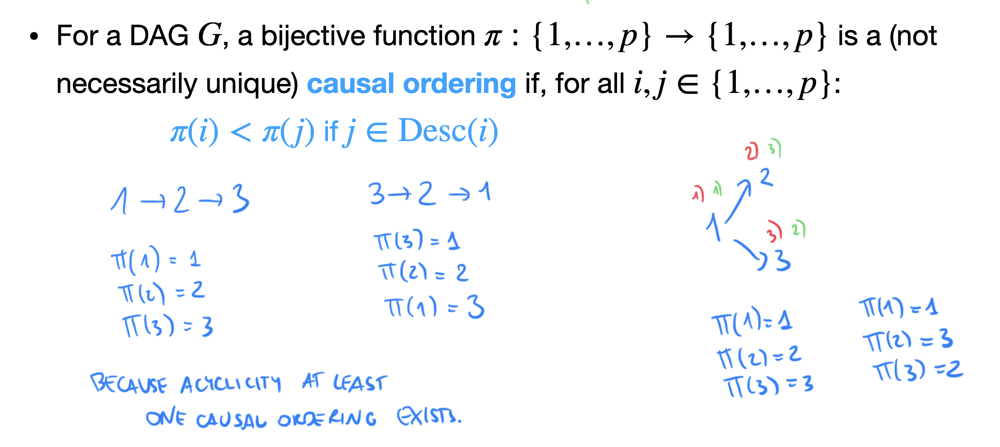

## Additive Noise Model (ANMs)
### RESIT (regression with subsequent independence test)
- must have non-gaussian noise
1. Regress X on Y with (possible nonlinear) regression and estimate $\hat{y}$
2. Test if residuals = y-$\hat{y}$ is independent of X
3. Regress Y on X with (possible nonlinear) regression and estimate  $\hat{x}$
4. Test if residuals = x-$\hat{x}$ is independent of Y
5. if independence is rejected in only one direction, the other independent direction is causal

## LINGAM (Linear Non-Gaussian Acyclic Models)
- must have non-gaussian noise (as if gaussian then cannot distinguish directions)
- don't need faithfullness (can work on cancelling paths)
- we can find true causal graph with assumptions

### Causal Ordering with matrix B
we can write B matrix in a strcitly lower triangular by permuting the variables using a causal ordering

### ICA (Independent Component Analysis)

