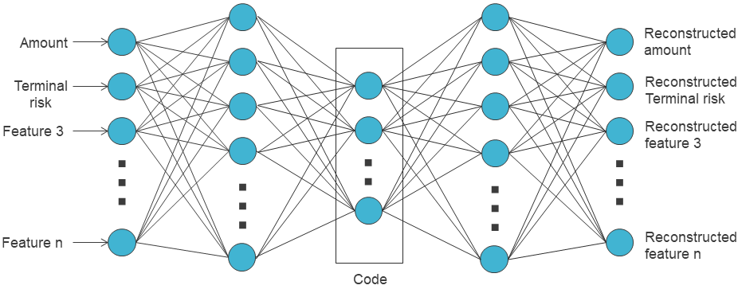

# Table of Contents

- [Table of Contents](#table-of-contents)
  - [Autoencoder Definition and usage](#autoencoder-definition-and-usage)
  - [Anomaly detection](#anomaly-detection)
  - [Representation learning](#representation-learning)
  - [Summary](#summary)

## Autoencoder Definition and usage

An autoencoder is a special type of deep learning architecture used to learn representations of data based solely on descriptive features. The representation, which is a transformation of the raw data, is learned with the objective to reconstruct the original data the most accurately. This representation learning strategy can be used for dimensionality reduction, denoising, or even generative applications.

An autoencoder can be divided into two parts:

* The encoder part that maps the input into the representation, also referred to as the "code" or the "bottleneck".
* The decoder that maps the code to a reconstruction of the input.

The encoder and decoder can have complex architectures like recurrent neural networks when dealing with sequential data or convolutional neural networks when dealing with images. But in their simplest form, they are multi-layer feed-forward neural networks. 

The dimension of the code, which is also the input of the decoder, can be fixed arbitrarily. This dimension is generally chosen to be lower than the original input dimension to reduce the dimensionality and to learn underlying meta variables. The dimension of the output of the decoder is the same as the input of the encoder because its purpose is to reconstruct the input.  

The architecture is generally trained end-to-end by optimizing the input reconstruction, i.e. by minimizing a loss that measures a difference between the model's output and the input. It can be trained with any unlabeled data. Note that when the autoencoder is "deep", i.e. there are intermediate layers $h_2$ and $h_2'$ respectively between the input $x$ and the bottleneck $h$ and between the bottleneck and the output $y$ (like in the figure above), one can train the layers successively instead of simultaneously. More precisely, one can first consider a submodel with only $x$, $h_2$ and $y$ and train it to reconstruct the input from the intermediate code $h_2$. Then, consider a second submodel with only $h_2$, $h$ and $h_2'$ and train it to reconstruct the intermediate code from the code $h$. Finally, fine-tune the whole model with $x$, $h_2$, $h$, $h_2'$ and $y$ to reconstruct the input.

Autoencoders can be used as techniques for unsupervised or semi-supervised anomaly detection, which led them to be used multiple times for credit card fraud detection {cite}an2015variational,zhou2017anomaly.

## Anomaly detection

Although not detailed before, fraud detection can be performed with both supervised and unsupervised techniques {cite}carcillo2019combining,veeramachaneni2016ai, as it is a special instance of a broader problem referred to as anomaly detection or outlier detection. The latter generally includes techniques to identify items that are rare or differ significantly from the "normal" behavior, observable in the majority of the data.

And one can easily see how a credit card fraud can be defined as an anomaly in transactions. These anomalies can be rare events or unexpected bursts in the activity of a single cardholder behavior, or specific patterns, not necessarily rare, in the global consumers' behavior. Rare events or outliers can be detected with unsupervised techniques that learn the normality and which are able to estimate discrepancy to this normality. But detection of other types of anomaly can require supervised techniques with proper training.

Therefore, one can think of three types of anomaly detection techniques:

Supervised techniques that were widely explored in previous sections and chapters. These techniques require annotations on data that consist of two classes, "normal" (or "genuine") and "abnormal" (or "fraud"), and they learn to discriminate between those classes.

Unsupervised techniques that aim at detecting anomalies by modeling the majority behavior and considering it as "normal". Then they detect the "abnormal" or fraudulent behavior by searching for examples that do not fit well to the normal behavior.

Semi-supervised techniques that are in between the two above cases and that can learn from both unlabeled and labeled data to detect fraudulent transactions.

An autoencoder can be used to model the normal behavior of data and detect outliers using the reconstruction error as an indicator. In particular, one way to do so is to train it to globally reconstruct transactions in a dataset. The normal trend that is observed in the majority of transactions will be better approximated than rare events. Therefore, the reconstruction error of "normal" data will be lower than the reconstruction error of outliers.

## Representation learning
Other than unsupervised anomaly detection, an autoencoder can simply be used as a general representation learning method for credit card transaction data. In a more complex manner than PCA, an autoencoder will learn a transformation from the original feature space to a representation space with new variables that encodes all the useful information to reconstruct the original data.

If the dimension of the code is chosen to be 2 or 3, one can visualize the transaction in the novel 2D/3D space. Otherwise, the code can also be used for other purposes, like:

- Clustering: Clustering can be performed on the code instead of the original features. Groups learned from the clustering can be useful to characterize the types of behaviors of consumers or fraudsters.

- Additional or replacement variables: The code can be used as replacement variables, or additional variables, to train any supervised learning model for credit card fraud detection.

## Summary

The autoencoder's goal is to learn representations to reconstruct descriptive variables, so it has been widely used for unsupervised learning problems. This method is interesting because anomaly detection, and in particular fraud detection, can be tackled with unsupervised or semi-supervised techniques. One way to use the autoencoder for that purpose is to consider its reconstruction error as an indicator for fraud risk. It can be used solely to detect outliers, but this generally leads to a low precision. It can also be used as an extra variable in supervised classification.