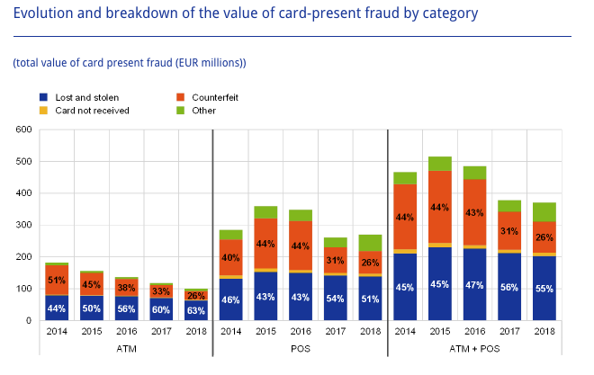
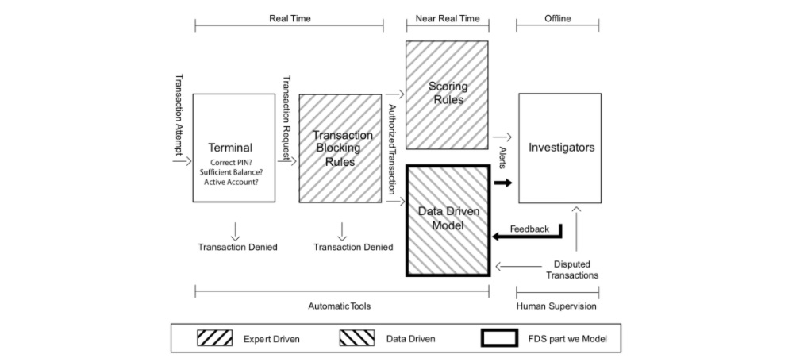

# Table of Contents

- [Table of Contents](#table-of-contents)
  - [1. Credit Card Scenarios](#1-credit-card-scenarios)
    - [1.1 Card-Present Frauds](#11-card-present-frauds)
    - [1.2 Card-Not-Present Frauds](#12-card-not-present-frauds)
  - [2. Credit card fraud detection system](#2-credit-card-fraud-detection-system)
    - [2.1 Terminal](#21-terminal)
    - [2.2 Transaction-Blocking Rules](#22-transaction-blocking-rules)
    - [2.3 Scoring Rules](#23-scoring-rules)
    - [2.4 Data-Driven Model (DDM)](#24-data-driven-model-ddm)
    - [2.5 Investigators](#25-investigators)
  - [3. Machine learning for credit card fraud detection](#3-machine-learning-for-credit-card-fraud-detection)
    - [3.1 Baseline methodology - Supervised learning](#31-baseline-methodology---supervised-learning)
    - [3.2 Five mostly mentioned ML techniques in CCF](#32-five-mostly-mentioned-ml-techniques-in-ccf)
    - [3.3 Chanlleges in CCF](#33-chanlleges-in-ccf)

## 1. Credit Card Scenarios
Worldwide financial losses caused by credit card fraudulent activities are worth tens of billions of dollars. According to the latest European Central Bank (ECB) report [Ban20], the total level of card fraud losses amounted to €1.8 billion in 2018 in the Single European Payment Area (SEPA).

### 1.1 Card-Present Frauds
Card-present frauds occur when a fraudster manages to make a successful fraudulent transaction using a physical payment card, either at an ATM or a POS. In this setting, fraud scenarios are usually categorized as lost or stolen cards, counterfeited cards, and card not received.

- Lost or stolen card
- Counterfeited card
- Card not received

Fig. 1. Evolution and breakdown of the value of card-present fraud by category within SEPA.

### 1.2 Card-Not-Present Frauds
Card-not-present refers to the general category of frauds conducted remotely, either by mail, phone, or on the Internet, using only some of the information present on a card.

Fig. 2. Evolution of total value of card fraud using cards issued within SEPA.  Card-not-present frauds account for the majority of reported frauds.

## 2. Credit card fraud detection system

A credit card Fraud Detection System (FDS) is typically composed of a set of five layers of control {cite}`dal2017credit,dal2015adaptive`, as illustrated in Fig. 3. 

Fig. 3. Diagram illustrating the layers of control in an FDS. Our focus in this book is mostly on the data-driven model, which helps investigators by raising alerts on the most suspicious transactions.

### 2.1 Terminal
The terminal represents the first control layer in an FDS and performs conventional security checks on all the payment requests [MekterovicBrkicBaranovic18, VVBC+15]. 

- Security checks include controlling the PIN code (possible only in case of cards provided with chip), the number of attempts, the card status (either active or blocked), the balance available, and the expenditure limit.
- These operations have to be performed in real-time (response has to be provided in a few milliseconds), during which the terminal queries a server of the card-issuing company. 

### 2.2 Transaction-Blocking Rules
Transaction-blocking rules are if-then (-else) statements meant to block transaction requests that are perceived as frauds [DP15, DPBC+17]. 

- These rules use the information available when the payment is requested, without analyzing historical records or cardholder profiles. An example of a blocking rule could be: “IF internet transactions AND unsecured website THEN deny the transaction”.
- Manually designed by the investigator and, as such, are expert-driven components of the FDS.
- All transactions passing blocking rules are finally authorized. However, the fraud detection activity continues after having enriched transaction data with aggregated features used to contextualize the current purchase with respect to the previous ones and the cardholder profile. These aggregated features include, for instance, the average expenditure, the average number of transactions in the same day, or the location of the previous purchases [DP15, VVBC+15, WHJ+09]. 

### 2.3 Scoring Rules
Scoring rules are also expert-driven models that are expressed as if-then (-else) statements [CDPLB+18, DPBC+17]. 

- Scoring rules are manually designed by investigators, which arbitrarily define their associated scores. An example of a scoring rule can be “IF previous transaction in a different continent AND less than one hour from the previous transaction THEN fraud score = 0.95”.
- Unfortunately, scoring rules can detect only fraudulent strategies that have already been discovered by investigators, and that exhibit patterns involving few components of the feature vectors. Moreover, scoring rules are rather subjective, since different experts design different rules. Finally, they can be incomplete and are difficult to maintain over time.

### 2.4 Data-Driven Model (DDM)
This layer is purely data-driven and adopts a classifier or another statistical model to estimate the probability for each feature vector to be a fraud.

- This probability is used as the fraud score associated with the authorized transactions. Thus, the data-driven model is trained from a set of labeled transactions and cannot be interpreted or manually modified by investigators.
- An effective data-driven model is expected to detect fraudulent patterns by simultaneously analyzing multiple components of the feature vector, possibly through nonlinear expressions. Therefore, the DDM is expected to find frauds according to rules that go beyond investigator experience

### 2.5 Investigators
Investigators are professionals experienced in analyzing credit card transactions and are responsible for the expert-driven layers of the FDS. In particular, investigators design transaction-blocking and scoring rules.

- In recent systems, transactions associated with very high-risk scores can bypass investigators and be directly sent to the cardholder for feedback requests (e.g. by SMS). This addition is interesting for an accelerated processing and a larger feedback bandwidth. However, it should be done with caution to avoid jeopardizing the customer’s trust.

## 3. Machine learning for credit card fraud detection

Credit card fraud detection (CCFD) is like looking for needles in a haystack. It requires finding, out of millions of daily transactions, which ones are fraudulent. Due to the ever-increasing amount of data, it is now almost impossible for a human specialist to detect meaningful patterns from transaction data. For this reason, the use of machine learning techniques is now widespread in the field of fraud detection, where information extraction from large datasets is required [Car18, DP15, LJ20, PP19].

Fig. 4. Number of published articles on the topic of machine learning and credit card fraud detection between 2010 and 2020. Source: Google Scholar.

### 3.1 Baseline methodology - Supervised learning

A wide number of ML techniques can be used to address the problem of CCFD. This is directly reflected by the huge amount of published papers on the topic in the last decade. Despite this large volume of research work, most of the proposed approaches follow a common baseline ML methodology [Bis06, FHT01, PL18], which we summarize in Fig. 5.

Fig. 5. ML for CCFD: Baseline methodology followed by most of the proposed approaches in the recent surveys on the topic.  

In credit card fraud detection, data typically consists of transaction data, collected for example by a payment processor or a bank. Transaction data can be divided into three groups {cite}`lucas2020credit,adewumi2017survey,VANVLASSELAER201538`

* Account-related features: They include for example the account number, the date of the account opening, the card limit, the card expiry date, etc.
* Transaction-related features: They include for example the transaction reference number, the account number, the transaction amount, the terminal (i.e., POS) number, the transaction time, etc. From the terminal, one can also obtain an additional category of information: merchant-related features such as its category code (restaurant, supermarket, ...) or its location.
* Customer-related features: They include for example the customer number, the type of customer (low profile, high profile, ...), etc.

### 3.2 Five mostly mentioned ML techniques in CCF
A wide range of methods exists for designing and training prediction models. This partly explains the large research literature on ML for CCFD, where papers usually focus on one or a couple of prediction methods. The survey from Priscilla et al. in 2019 {cite}`priscilla2019credit` provides a good overview of the machine learning methods that have been considered for the problem of CCFD. Their survey covered close to one hundred research papers, identifying for each paper which ML techniques were used, see Fig. 6.  

Fig. 6. Usage frequency of ML techniques in CCFD. Source: Priscilla et al., 2019 {cite}`priscilla2019credit`. References given in the table are in {cite}`priscilla2019credit`. 

Five types of methods: logistic regression (LR), decision trees (DT), Random forests (RF), Boosting, and Neural networks/Deep learning (NN/DL). LR and DT were chosen due to their simplicity and interpretability. RF and Boosting were chosen since they are currently considered to be state-of-the-art in terms of performance. NN/DL methods were chosen since they provide promising research directions.  

### 3.3 Chanlleges in CCF

**Class imbalance**: Transaction data contain much more legitimate than fraudulent transactions: The percentage of fraudulent transactions in a real-world dataset is typically well under 1%. Learning from imbalanced data is a difficult task since most learning algorithms do not handle well large differences between classes. Dealing with class imbalance requires the use of additional learning strategies like sampling or loss weighting, a topic known as *imbalanced learning*. 

**Concept drift**: Transaction and fraud patterns change over time. On the one hand, the spending habits of credit card users are different during weekdays, weekends, vacation periods, and more generally evolve over time. On the other hand, fraudsters adopt new techniques as the old ones become obsolete. These time-dependent changes in the distributions of transactions and frauds are referred to as *concept drift*. Concept drift requires the design of learning strategies that can cope with temporal changes in statistical distributions, a topic known as *online learning*. The concept drift problem is accentuated in practice by the delayed feedbacks (See section {ref}`Fraud_Detection_System`).

**Near real-time requirements**: Fraud detection systems must be able to quickly detect fraudulent transactions. Given the potentially high volume of transaction data (millions of transactions per day), classification times as low as tens of milliseconds may be required. This challenge closely relates to the *parallelization* and *scalability* of fraud detection systems.

**Categorical features**: Transactional data typically contain numerous *categorical* features, such as the ID of a customer, a terminal, the card type, and so on. Categorical features are not well handled by machine learning algorithms and must be transformed into numerical features. Common strategies for transforming categorical features include feature aggregation, graph-based transformation, or deep-learning approaches such as feature embeddings.

**Sequential modeling**: Each terminal and/or customer generates a stream of sequential data with unique characteristics. An important challenge of fraud detection consists in modeling these streams to better characterize their expected behaviors and detect when abnormal behaviors occur. Modeling may be done by aggregating features over time (for example, keeping track of the mean frequency or transaction amounts of a customer), or by relying on sequential prediction models (such as hidden Markov models, or recurrent neural networks for example). 

**Class overlap**: The last two challenges can be associated with the more general challenge of overlapping between the two classes. With only raw information about a transaction, distinguishing between a fraudulent or a genuine transaction is close to impossible. This issue is commonly addressed using feature engineering techniques, that add contextual information to raw payment information.  

**Performance measures**: Standard measures for classification systems, such as the mean misclassification error or the AUC ROC, are not well suited for detection problems due to the class imbalance issue, and the complex cost structure of fraud detection. A fraud detection system should be able to maximize the detection of fraudulent transactions while minimizing the number of incorrectly predicted frauds (false positives). It is often necessary to consider multiple measures to assess the overall performance of a fraud detection system. Despite its central role in the design of a fraud detection system, there is currently no consensus on which set of performance measures should be used. 

**Lack of public datasets**: For obvious confidentiality reasons, real-world credit card transactions cannot be publicly shared. There exists only one publicly shared dataset, which was made available on Kaggle {cite}`Kaggle2016` by our team in 2016. Despite its limitations (only two days of data, and obfuscated features), the dataset has been widely used in the research literature, and is one of the most upvoted and downloaded on Kaggle. The scarcity of datasets for fraud detection is also true with simulated data: No simulator or reference simulated datasets are yet available. As a result, most research works cannot be reproduced, making impossible the comparison of different techniques by independent researchers.    