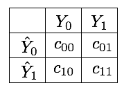
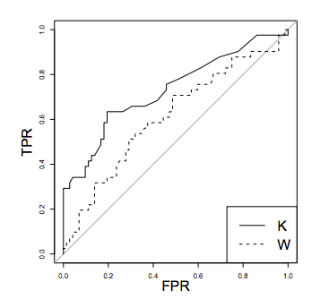

- [Table of Contents](#table-of-contents)
  - [1. Threshold-based metrics](#1-threshold-based-metrics)
    - [1.1 Mean misclassification error](#11-mean-misclassification-error)
    - [1.2 Cost matrix and weigthed loss](#12-cost-matrix-and-weigthed-loss)
    - [1.3 Other performance metrics derived from the confusion matrix¶](#13-other-performance-metrics-derived-from-the-confusion-matrix)
  - [2. Threshold-free metrics](#2-threshold-free-metrics)
    - [2.1 Receiving Operating Characteristic (ROC) curve](#21-receiving-operating-characteristic-roc-curve)
    - [2.2 Precision-Recall curve](#22-precision-recall-curve)
  - [3. Precision top-k metrics](#3-precision-top-k-metrics)
    - [3.1 Transaction Precision top-k](#31-transaction-precision-top-k)
    - [3.2 Card Precision top-k](#32-card-precision-top-k)
  - [4. Summary](#4-summary)


# Table of Contents
## 1. Threshold-based metrics
### 1.1 Mean misclassification error

The most straightforward way to assess the performance of a binary classifier is by computing the proportion of misclassified instances. This quantity is known as the mean misclassification error (MME) and is computed as follows 

$$MME= \frac{FP+FN}{N}$$

where $N=TN+TP+FN+FP$ is the size of the dataset.

Note that the complementary $1-MME = \frac{TP+TN}{N}$ is sometimes used instead and referred to as the *accuracy score* (`sklearn.metrics.accuracy_score`). 

> The main shortcoming of the MME: it gives the same weight to false negatives and false positives. A more disproportionate case with more genuine transaction would further exacerbate this behavior.

### 1.2 Cost matrix and weigthed loss
A possible approach to fix the $MME$ presented above is by defining a *cost matrix*. The cost matrix quantifies, for each outcome in the confusion matrix, an associated cost. It is a 2 * 2 matrix, whose entries are denoted $c_{ij}$ following the notations from {cite}`elkan2001foundations`.
<center>


</center>
<p style="text-align: center;">
Fig. 1. Example of cost matrix.
</p>

The misclassification error can then be expressed as an expected weighted loss, by multiplying each entry of the confusion matrix with the corresponding entry in the cost matrix {cite}`fernandez2018learning,gupta2020class`. Denoting by $WL$ this quantity (weighted loss), we get

```math
WL= \frac{TN*c_{00}+FN*c_{01}+FP*c_{10}+TP*c_{11}}{N}
```

The costs of true negatives and true positives is usually $0$, since these are the entries that correspond to correct classifications. This simplifies the expression of $WL$ to:

$$
WL= \frac{FN*c_{01}+FP*c_{10}}{N}
$$

It is however in practice difficult to set the values $c_{01}$ and $c_{10}$ {cite}`dal2015adaptive`. 

### 1.3 Other performance metrics derived from the confusion matrix¶

Column-wise, two meaningful quantities are the True Positive Rate (TPR) and the True Negative Rate (TNR). The TPR
measures the proportion of positives that are correctly identified (e.g., the proportion of frauds that are correctly classified as frauds). It is also called *recall*, *hit rate*, or *sensitivity*. It is defined as:

$$TPR = Recall = \frac{TP}{TP+FN}$$

The TNR measures the proportion of negatives that are correctly identified (e.g., the proportion of genuine transactions that are correctly classified as genuine). It is also called *specificity*, or *selectivity*. It is defined as:

$$TNR = \frac{TN}{TN+FP}$$

Alternatively, the complementary measures, i.e the proportions of incorrect predictions, can also be computed. They are called the False Negative Rate (FNR) and False Positive Rate (FPR). Note that the FNR and TPR sum up to $1$, as do the FPR and TNR.

$$FNR = \frac{FN}{TP+FN} = 1-TPR$$

$$FPR = \frac{FP}{TN+FP} = 1-TNR$$

Taking the mean of the FNR and the TNR provides a balanced measure of accuracy known as the Balanced Error Rate (BER) {cite}`fernandez2018learning`:

$$BER = 0.5*(FNR+FPR)$$

The BER is a weighted loss where the misclassification costs make up for the class imbalance. An alternative measure that aggregates the TNR and TPR is the geometric mean G-mean, defined as the $G-mean = \sqrt{TPR × TNR}$ {cite}`fernandez2018learning`.


Row-wise, the most commonly used metric is the precision, also known as *Positive Predicted Value*. It measures, for the set of transactions that are predicted as fraudulent, the proportion of transactions that are indeed fraudulent. 

$$Precision = \frac{TP}{TP+FP}$$

A system with high recall but low precision returns many alerts, but most of the alerts are incorrect when compared to the ground-truth labels (many false positives). A system with high precision but low recall is just the opposite, returning very few alerts, but most of its alerts are correct when compared to the training labels. An ideal system with high precision and high recall returns many alerts, with all alerts labeled correctly. For a fully automated blocking system, a high precision would be favored. For a system with a second layer of human verification, a high recall is beneficial as the false positives will be discarded anyway by the investigators, within the limit of their bandwidth.

The three other metrics which can be computed row-wise are the Negative Predictive Value (NPV), the False Discovery Rate (FDR), and the False Ommission Rate (FOR). They are defined as {cite}`fernandez2018learning`


$$NPV = \frac{TN}{TN+FN} $$
$$FDR = \frac{FP}{TP+FP}=1-Precision $$
$$FOR = \frac{FN}{TN+FN}=1-NPV $$


An aggregate measure of the precision and recall often used in practice is the *F1-score*. It is defined as the harmonic mean of the two quantities:

$$\textrm{F1-score} = 2*\frac{Precision*Recall}{Precision+Recall}$$

F1-score and G-mean are often considered to be relevant measures in imbalanced problems {cite}`chawla2008automatically`,{cite}`chen2004using`. These measures can however be computed only once a confusion matrix is available, which means that their values depend on the threshold $t$ used for classification. Changing the threshold corresponds to using different misclassification costs.


## 2. Threshold-free metrics
### 2.1 Receiving Operating Characteristic (ROC) curve

The Receiving Operating Characteristic (ROC) curve [Faw04, Faw06] is obtained by plotting the Recall (or True Positive Rate - TPR) against the False Positive Rate (FPR) for all the different classification thresholds . It is the de-facto standard for estimating the performance of fraud detection systems in the literature [DP15].

A classifier K is said to be more performant than a classifier W in the ROC space only if the curve of K always dominates the curve of W.

<center>


</center>

<div align="center">Fig. 3. The Receiving Operating Characteristic (ROC) curve for two classifiers K and W. <br>The gray line represents the performance of a random model.
</div>

ROC curves have three important properties {cite}`fernandez2018learning`. 

First, they are monotonic functions: The TPR can only increase as the FPR increases. 

Second, the area under the curve has a probabilistic interpretation: The AUC ROC can be interpreted as the probability that the scores given by a classifier will rank a randomly chosen positive instance higher than a randomly chosen negative one. 

Third, the AUC ROC of a random classifier is $0.5$. The last property can be easily checked by setting all predictions to 0.5. This gives a list of only two thresholds. The first is 1.5, which classifies all predictions as genuine. The second is 0.5, which classifies all predictions as fraudulent.  

> Limit: ROC curves are relevant to get a sense of a classifier performance over the whole range of possible FPR. Their interest for fraud detection is however limited since an important goal of fraud detection is to keep the FPR very low. Due to the imbalanced nature of the problem, 99.9% of what is represented on the ROC curve has little relevance from the perspective of an operational fraud detection system where fraudulent transactions must be checked by a limited team of investigators.

### 2.2 Precision-Recall curve

The Precision-Recall curve (PR curve) is obtained by plotting the precision against the recall (or True Positive Rate - TPR) for all the different classification thresholds . The main advantage of the PR curve is to put in evidence classifiers that can have both a high recall and a high precision (which indirectly translates to a high TPR and a low FPR).

PR curves behave differently from ROC curves.

First, they are not monotonic: The precision may decrease or increase, as the recall increases. This is illustrated above, where for a recall of $0.5$, the precision first goes down to $0.33$ (threshold $0.4$), before going up to $0.5$ (threshold $0.35$). 

Second, their AUC does not carry a statistical interpretation as ROC AUC. However, it can be shown that there exists a one-to-one correspondence between PR and ROC curves, and that a curve that dominates in the PR space necessarily dominates in the ROC space {cite}`davis2006relationship`. 

Third, the performance of a random classifier depends on the class imbalance. It is $0.5$ in the balanced case, and $P/(P+N)$ in the general case, where $P$ is the number of positive examples, and $N$ the number of negative examples. In particular, a classifier that classifies all examples as positive (recall of 1) has a precision of $P/(P+N)$. In the example above, this gives a precision of $2/(2+8)=0.2$, highlighted with the dotted red line. This property makes the AP more interesting than the AUC ROC in a fraud detection problem, since it better reflects the challenge related to the class imbalance problem (the AP of a random classifier decreases as the class imbalance ratio increases).  

## 3. Precision top-k metrics

Precisions are computed daily, reflecting the precisions obtained for a working day of fraud investigators. The $k$ parameter quantifies the maximum number of alerts that can be checked by investigators in a day. 


### 3.1 Transaction Precision top-k
The  can be computed for a day by ranking all fraud probabilities by decreasing order, and computing the precision for the top ranked transactions.

### 3.2 Card Precision top-k
*Card Precision Top-$k$*, or $CP@k$, quantifies the number of correctly detected compromised cards out of the $k$ cards which have the highest risks of frauds.

$CP@k$ can be computed by slightly amending the implementation of the Precision top-$k$ given above. More specifically, instead of simply sorting transactions by decreasing order of their fraud probabilities, we first group transactions by customer ID. For each customer ID, we then take the maximum value of the fraud probability and the fraud label. This can be computed in a single line of code with the Panda `group_by` and `max` operators. The card precision top-$k$ is finally computed by sorting customer IDs by decreasing order the fraud probabilities and computing the precision for the set of $k$ cards with the highest fraud probabilities. 


## 4. Summary

A fraud detection system aims at optimizing two conflicting goals. On the one hand, the system should maximize the detection of fraudulent transactions, a metric known as recall. On the other hand, it should also minimize the number of false positives, that is, the number of genuine transactions which are incorrectly predicted as frauds. Unless a perfect classifier can be designed, maximizing the recall comes at a cost in terms of false positives. The cost structure of a fraud detection system is however complex, if not impossible, to determine.

A common approach to circumvent this conflicting goal is to assess the recall and false positive rates for all possible decision thresholds. The resulting function is the Receiving Operating Characteristic (ROC) curve. The area under the ROC curve (known as AUC ROC) is the most widely used metric to assess the performance of fraud detection systems. This chapter highlighted that the AUC ROC is however poorly adapted to class imbalanced problems such as fraud detection. Two other metrics, the Average Precision (AP), and the daily Card Precision top- (CP@k) were motivated to better characterize the performances of a CCFD.

The AUC ROC, AP, and CP@k are complementary. The AUC ROC reflects the accuracy of the detection system for all possible thresholds. The AP also reflects the accuracy of the detection system for all possible thresholds but gives more importance to regions of the decision thresholds where the precision remains high. Finally, the CP@k provides a more concrete metric for CCFD, by assessing the average daily precision of the system, assuming that a maximum of  cards can be checked daily by investigators.

Due to their complementarity, we recommend assessing the performance of a fraud system by using these three performance measures.